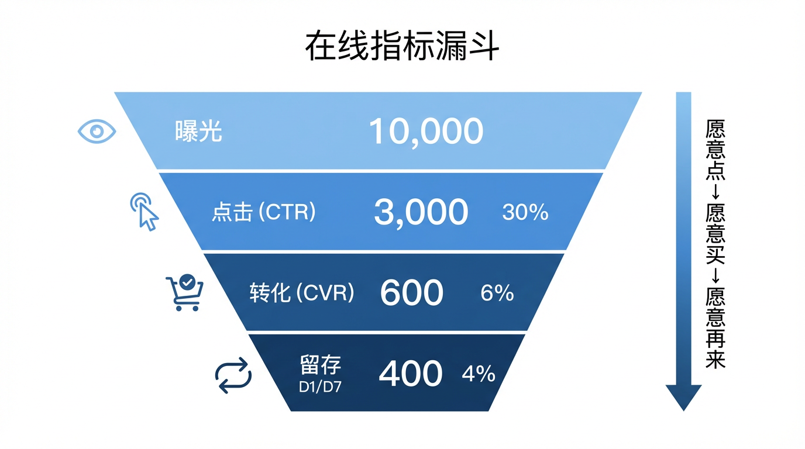
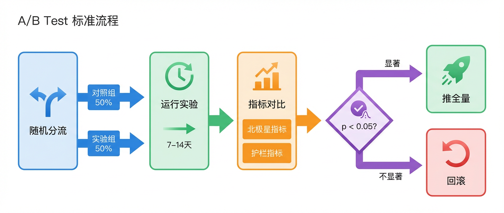

# 评测体系：线上与离线，谁说了算？

推荐系统在不同业务场景中有着不同的核心目标，比如电商追求转化，内容平台看重停留时长。但如何判断一个推荐系统的好坏？怎样衡量它是否达成了业务目标？这就需要一套完整的“尺子”——也就是评测体系。

推荐系统的评测体系主要分为两大块：离线评测与在线评测。离线评测就像实验室里的“模拟考”，在模型上线前筛掉不合格的方案；在线评测则是真实环境中的“实战”，直接对接业务效果。除此之外，还有一些看似“虚无缥缈”却能决定用户体验的“魔法”指标。而 A/B Test，就是连接离线与在线、验证系统真实价值的关键桥梁。

*评测总览：离线筛选、线上验证、护栏防风险、长期看体验*

## 离线评测：用历史数据做“模拟考”

离线评测的基本做法是：把历史日志切成**训练集 / 测试集**，让模型在训练集学习，在测试集上打分。

这里有个非常重要的事实：离线评测里我们并不知道“用户真正喜欢的全集”。所谓的“正确答案”，通常用**测试集里的正反馈**来近似（例如：用户在某个时间窗里点击/购买过的物品）。所以离线评测衡量的是“**能否复现历史行为**”，而不是“上线后一定更好”。

为了写清楚公式，我们先定义两个集合（对每个用户 $u$）：
- **推荐列表**：$R_u@K$：模型给用户 $u$ 的前 $K$ 个推荐。
- **离线真值集合**：$G_u$：测试集中用户 $u$ 的正反馈物品集合（点击/购买/收藏等）。

### 1.1 分类类指标：推得准不准（Precision / Recall / F1）

这类指标把推荐看作一个“猜谜游戏”：你猜用户喜不喜欢这个东西？

- **Precision@K（准确率）**：**推得准不准？**
  - **直觉**：你推了 10 个，用户点了几个？如果点了 3 个，准确率就是 30%。它衡量的是“不瞎推”的能力。
  
  $$
  \text{Precision@K}(u)=\frac{|R_u@K \cap G_u|}{K}
  $$

- **Recall@K（召回率）**：**漏没漏掉？**
  - **直觉**：用户实际喜欢 5 个，你推的这 10 个里涵盖了其中几个？如果涵盖了 3 个，召回率就是 60%。它衡量的是“能不能把用户喜欢的都找出来”。
  
  $$
  \text{Recall@K}(u)=\frac{|R_u@K \cap G_u|}{|G_u|}
  $$

- **F1@K**：**准和全的平衡**
  - **直觉**：准确率和召回率往往打架（只推 1 个最有把握的，准确率高但召回率低；推 1000 个，召回率高但准确率惨不忍睹）。F1 是两者的调和平均，用来找平衡点。

  $$
  \text{F1@K}(u)=\frac{2 \cdot P \cdot R}{P+R}
  $$

  其中 $P=\text{Precision@K}(u)$，$R=\text{Recall@K}(u)$。

> **小例子**：设 $K=10$，用户真实点击了 5 个物品（$|G_u|=5$）。模型推了 10 个，其中命中了 3 个。  
> 此时：Precision = 3/10 = 0.3；Recall = 3/5 = 0.6；F1 $\approx$ 0.4。

### 排序类指标：排得好不好（HR@K / NDCG@K）

只猜对不够，还得**排得好**。推荐系统给用户的是一个有序列表，把用户最喜欢的放在最前面，体验才最好。

- **Hit Rate@K（HR@K，命中率）**：**有没有打中？**
  - **直觉**：不管排第几，只要前 $K$ 个里有一个用户喜欢的，就算命中。这像是一刀切的“及格线”。
  
  $$
  \text{HR@K}(u)=\mathbb{1}\left(|R_u@K \cap G_u|>0\right)
  $$

- **NDCG@K（归一化折损累计增益）**：**好东西有没有排前面？**
  - **直觉**：这个指标很“势利”——**位置越靠前，价值越大**。如果你把用户最喜欢的排在第 1 位，得满分；排在第 10 位，得分打骨折；排在第 100 位，几乎不得分。这是衡量排序质量的**黄金标准**。

  公式看起来稍微复杂一点：

  $$
  \text{DCG@K}=\sum_{i=1}^{K}\frac{2^{rel_i}-1}{\log_2(i+1)}
  $$

  $$
  \text{NDCG@K}=\frac{\text{DCG@K}}{\text{IDCG@K}}
  $$

  简单说：$DCG$ 是实际得分，$IDCG$ 是完美排序下的最高分，除一下就是 0~1 的归一化分数。

### 回归类指标：评分预测准不准（RMSE）

- **RMSE（均方根误差）**：**打分准不准？**
  - **直觉**：主要用于电影评分这种场景。用户打 4 星，你预测 3.8 星，误差很小；你预测 2 星，误差很大。RMSE 就是所有误差平方和的“平均值再开方”。

  $$
  \text{RMSE}=\sqrt{\frac{1}{N}\sum_{(u,i)}(r_{ui}-\hat r_{ui})^2}
  $$

> **离线的局限性**：离线指标再高，也只是“模拟考”。因为它没法模拟用户的实时心情、也没法反馈你的新推荐策略（比如你新推了一个冷门好片，离线数据里用户没点过，离线算分就会低，但实际上线用户可能很喜欢）。所以，必须看在线指标。

## 在线指标：真实世界的北极星

一旦上线，我们就不再看“预测误差”了，而是看真实的**商业价值**和**用户体验**。这些指标像北极星一样，指引团队优化的方向。

- **CTR（点击率）**：**愿意点吗？**
  - **直觉**：最基础的门槛。推荐的东西如果不吸引人，用户连点都不点，后面的一切都无从谈起。
  
  $$
  \text{CTR}=\frac{\text{点击量}}{\text{曝光量}}
  $$

- **CVR（转化率）**：**愿意买/看完吗？**
  - **直觉**：光点进来没用，得看有没有达成最终目标（下单、看完视频、下载 App）。CTR 高但 CVR 低，说明你是“标题党”，把人骗进来杀。

  $$
  \text{CVR}=\frac{\text{转化量}}{\text{点击量}}
  $$

- **Retention（留存率）**：**愿意再来吗？**
  - **直觉**：这是衡量产品生死的**王牌指标**。如果你为了短期 CTR 拼命推低俗内容，用户爽了一把但觉得 App 很 low，明天卸载了，那留存率就崩了。留存代表了长期的满意度。

  $$
  \text{D1 Retention}=\frac{\text{第 }t+1\text{ 天仍活跃的人数}}{\text{第 }t\text{ 天的新增/活跃人数}}
  $$

> **护栏指标**：为了防止“翻车”，我们还得盯着一些“报警器”——比如**时延**（推荐太慢用户跑了）、**负反馈率**（用户狂点“不感兴趣”）、**投诉率**等。

*在线指标漏斗：从“愿意点”到“愿意再来”*

## “魔法”指标：用户体验的隐形守护者

只追 CTR，推荐系统很容易变得“无聊”——总是推你之前看过的东西（总是推红烧肉，也会腻）。为了让推荐更有“魔法”，我们需要关注以下指标：

### 多样性（Diversity）：别把鸡蛋放一个篮子里

- **直觉**：同样是推运动内容，既要有足球，也要有篮球、装备、训练方法。如果 10 条全是足球，多样性就低，用户容易审美疲劳。
  
  $$
  \text{Diversity}=1-\frac{2}{K(K-1)}\sum_{i<j}sim(i,j)
  $$

  翻译过来就是：列表里的东西，两两之间越**不像**，多样性越高。

### 覆盖率（Coverage）：别只盯着爆款

- **直觉**：系统里有 100 万个商品，推荐系统是只盯着那 100 个热门爆款推，还是能把冷门的长尾商品也挖出来？覆盖率高，说明系统“不偏食”，能充分利用长尾资源。

  $$
  \text{Coverage}=\frac{\left|\bigcup_u R_u@K\right|}{|I|}
  $$

### 惊喜度（Serendipity）：意料之外，情理之中

- **直觉**：这是最高级的指标。它不是乱推，而是**相关但意外**。比如你从未搜过“爵士乐”，但系统通过你喜欢“村上春树”的书，推断你可能喜欢爵士，推了一首给你，你一听——“哇，真好听！”这就是惊喜。它比单纯的准确更难，但也更迷人。

  $$
  \text{Serendipity@K}(u) \propto \sum \text{Rel}(u,i) \cdot (1 - \text{Sim}(i, \text{History}_u))
  $$
  
  公式含义：既要**用户喜欢**（Rel 高），又要**和历史兴趣不像**（Sim 低）。

*权衡：越追短期点击，越可能牺牲多样性与新颖性*

## A/B Test：最终的裁判

既然离线指标不完全可信，在线指标又容易波动，怎么确定新模型一定比旧模型好？

答案是 **A/B Test（分流实验）**。

- **对照组（Control）**：旧策略
- **实验组（Treatment）**：新策略

让这两组用户在完全相同的时间、环境下运行，唯一的变量就是“推荐策略”。一段时间后，对比两组的 CTR、CVR、留存等核心指标。

$$
\Delta=\text{Metric}_{\text{exp}}-\text{Metric}_{\text{ctrl}}
$$

**线上数据才是最终的裁判**。因为真实世界里有太多的变量（曝光偏差、反馈闭环、界面影响、用户心情），离线无法完全模拟。A/B Test 是连接算法模型与商业价值的最后一道桥梁，也是推荐工程师必须敬畏的“实战演练”。

*A/B Test：线上验证的标准流程*

